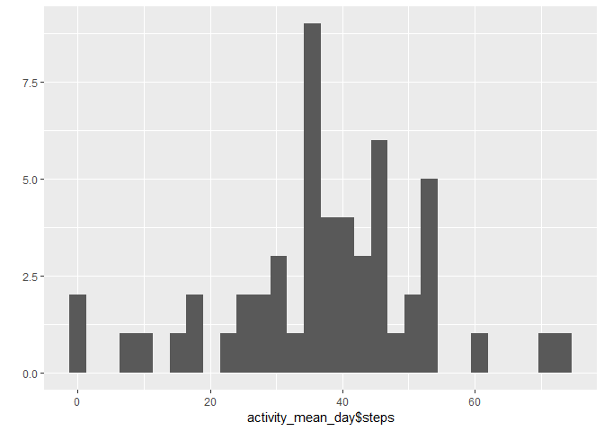

## Loading and preprocessing the data

In this step, the "activity.zip" file is unzipped and loaded into the variable "activity"  
Then let's show the structure of the file to determine the colum names and data types:

Before anythign else, let's load the necessary libraries:

```r
library(dplyr)
library(lubridate)
library(ggplot2)
```


```r
activity <- read.csv(unzip("activity.zip"))
str(activity)
```

```
## 'data.frame':	17568 obs. of  3 variables:
##  $ steps   : int  NA NA NA NA NA NA NA NA NA NA ...
##  $ date    : Factor w/ 61 levels "2012-10-01","2012-10-02",..: 1 1 1 1 1 1 1 1 1 1 ...
##  $ interval: int  0 5 10 15 20 25 30 35 40 45 ...
```

Because the column "date" is a "Factor" let's convert it to a Date Type

```r
activity$date <- as.POSIXct(as.character(activity$date), "%Y-%m-%d", tz = Sys.timezone())
```

Now let's get a data.frame without the missing values to have it handy if needed.

```r
activity_not_na <- activity %>% filter_all(all_vars(!is.na(.))) 
```

## What is mean total number of steps taken per day?

Calculate the mean for each day (ignoring the missing values).  
After the means are claculated, a "summary" of the results is printed to show the Mean and Median:

```r
activity_mean_day <- aggregate(steps~date, data=activity, mean, na.rm=TRUE)
summary(activity_mean_day)
```

```
##       date                         steps        
##  Min.   :2012-10-02 00:00:00   Min.   : 0.1424  
##  1st Qu.:2012-10-16 00:00:00   1st Qu.:30.6979  
##  Median :2012-10-29 00:00:00   Median :37.3785  
##  Mean   :2012-10-30 17:37:21   Mean   :37.3826  
##  3rd Qu.:2012-11-16 00:00:00   3rd Qu.:46.1597  
##  Max.   :2012-11-29 00:00:00   Max.   :73.5903
```

Now, let's show the Histogram:

```r
qplot(activity_mean_day$steps, geom="histogram") 
```

```
## `stat_bin()` using `bins = 30`. Pick better value with `binwidth`.
```

<!-- -->


## What is the average daily activity pattern?


## Imputing missing values


## Are there differences in activity patterns between weekdays and weekends?
