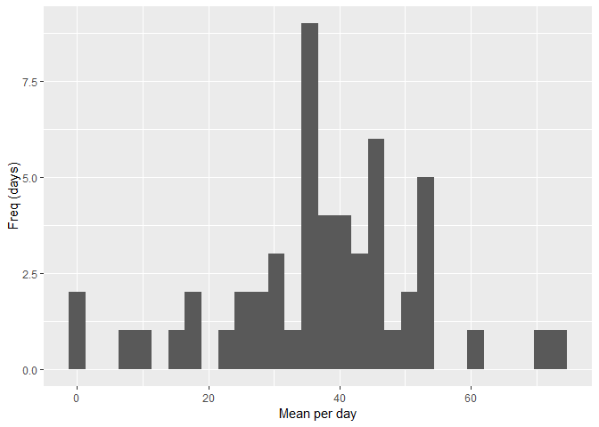

## Loading and preprocessing the data

In this step, the "activity.zip" file is unzipped and loaded into the variable "activity"  
Then let's show the structure of the file to determine the colum names and data types:

Before anythign else, let's load the necessary libraries:

```r
library(dplyr)
library(lubridate)
library(ggplot2)
```


```r
activity <- read.csv(unzip("activity.zip"))
str(activity)
```

```
## 'data.frame':	17568 obs. of  3 variables:
##  $ steps   : int  NA NA NA NA NA NA NA NA NA NA ...
##  $ date    : Factor w/ 61 levels "2012-10-01","2012-10-02",..: 1 1 1 1 1 1 1 1 1 1 ...
##  $ interval: int  0 5 10 15 20 25 30 35 40 45 ...
```

Because the column "date" is a "Factor" let's convert it to a Date Type

```r
activity$date <- as.POSIXct(as.character(activity$date), "%Y-%m-%d", tz = Sys.timezone())
```

Now let's get a data.frame without the missing values to have it handy if needed.

```r
activity_not_na <- activity %>% filter_all(all_vars(!is.na(.))) 
```
  
    
## What is mean total number of steps taken per day?
  
Calculate the mean for each day (ignoring the missing values).  
After the means are claculated, a "summary" of the results is printed to show the Mean and Median:

```r
activity_mean_day <- aggregate(steps~date, data=activity, mean, na.rm=TRUE)
summary(activity_mean_day)
```

```
##       date                         steps        
##  Min.   :2012-10-02 00:00:00   Min.   : 0.1424  
##  1st Qu.:2012-10-16 00:00:00   1st Qu.:30.6979  
##  Median :2012-10-29 00:00:00   Median :37.3785  
##  Mean   :2012-10-30 17:37:21   Mean   :37.3826  
##  3rd Qu.:2012-11-16 00:00:00   3rd Qu.:46.1597  
##  Max.   :2012-11-29 00:00:00   Max.   :73.5903
```

Now, let's show the Histogram:

```r
qplot(activity_mean_day$steps, geom="histogram", xlab = "Mean per day", bins=30, ylab = "Freq (days)") 
```

<!-- -->
  
  
## What is the average daily activity pattern?
Calculate the average (mean) for each day (ignoring the missing values).  

```r
activity_mean_interval <- aggregate(steps~interval, data=activity, mean, na.rm=TRUE)
summary(activity_mean_interval)
```

```
##     interval          steps        
##  Min.   :   0.0   Min.   :  0.000  
##  1st Qu.: 588.8   1st Qu.:  2.486  
##  Median :1177.5   Median : 34.113  
##  Mean   :1177.5   Mean   : 37.383  
##  3rd Qu.:1766.2   3rd Qu.: 52.835  
##  Max.   :2355.0   Max.   :206.170
```
Now, let's show a time series plot:

```r
ggplot(activity_mean_interval, aes(interval, steps)) + geom_line() +
  xlab("5-minute Inteval") + ylab("Average of Steps") 
```

<!-- -->
  
Now, let's determine which 5-minute interval contains the maximum number of steps:    

```r
max_interval <- activity_mean_interval[which.max(activity_mean_interval$steps),]
max_interval
```

```
##     interval    steps
## 104      835 206.1698
```
      
## Imputing missing values
Calculate and report the total number of missing values in the dataset

```r
missing_values <- is.na(activity)
missing_steps <- sum(missing_values[,1])
missing_date <- sum(missing_values[,2])
missing_interval <- sum(missing_values[,3])
```
The total missing values for the column "steps"  : 2304   
The total missing values for the column "date"   : 0   
The total missing values for the column "inteval": 0   
  
To fill the missing values for the column "steps", let's use the "mean" for each partiular inteval:

```r
activity_filled_na <- activity %>% group_by(interval) %>% mutate(steps = ifelse(is.na(steps), mean(steps, na.rm = TRUE), steps))
head(activity_filled_na)
```

```
## # A tibble: 6 x 3
## # Groups:   interval [6]
##    steps date                interval
##    <dbl> <dttm>                 <int>
## 1 1.72   2012-10-01 00:00:00        0
## 2 0.340  2012-10-01 00:00:00        5
## 3 0.132  2012-10-01 00:00:00       10
## 4 0.151  2012-10-01 00:00:00       15
## 5 0.0755 2012-10-01 00:00:00       20
## 6 2.09   2012-10-01 00:00:00       25
```

Now let's calculate again the mean for each day but now using the new data.frame with filled missing values  
After the means are calculated, a "summary" of the results is printed to show the Mean and Median:

```r
activity_filled_na_mean_day <- aggregate(steps~date, data=activity_filled_na, mean, na.rm=TRUE)
summary(activity_filled_na_mean_day)
```

```
##       date                         steps        
##  Min.   :2012-10-01 00:00:00   Min.   : 0.1424  
##  1st Qu.:2012-10-16 00:00:00   1st Qu.:34.0938  
##  Median :2012-10-31 00:00:00   Median :37.3826  
##  Mean   :2012-10-31 00:25:34   Mean   :37.3826  
##  3rd Qu.:2012-11-15 00:00:00   3rd Qu.:44.4826  
##  Max.   :2012-11-30 00:00:00   Max.   :73.5903
```

Now, let's show the Histogram:

```r
qplot(activity_filled_na_mean_day$steps, geom="histogram", xlab = "Mean per day", bins=30, ylab = "Freq (days)", main="Histogram with filled missing values") 
```

<!-- -->
    
    
With the method described above to fill the missing values, it doesn't affect that much the results. Perhpas, with other method, other results might be gotton. 
Although the "1st Qu" and "3rd Qu" are around 4 and 2 point differents (respectivally), the "Median" and the "Mean" didn't change that much.  
   
      
## Are there differences in activity patterns between weekdays and weekends?


```r
activity_filled_na$weekday <- ifelse(weekdays(activity_filled_na$date) %in% c("Saturday", "Sunday"), "weekend", "weekday")
activity_filled_na$weekday <- factor(activity_filled_na$weekday)
table(activity_filled_na$weekday)
```

```
## 
## weekday weekend 
##   12960    4608
```
  
Now, let's show a time series plot:

```r
activity_filled_na_mean_interval <- aggregate(steps~interval+weekday, data=activity_filled_na, mean, na.rm=TRUE)
ggplot(activity_filled_na_mean_interval, aes(interval, steps)) + geom_line() +
  facet_grid(weekday~.) + xlab("5-minute Inteval") + ylab("Average of Steps") 
```

<!-- -->
  
Based on the graph shown above, it seems there is more activity (more steps) during the weekends.  
.  
.  
